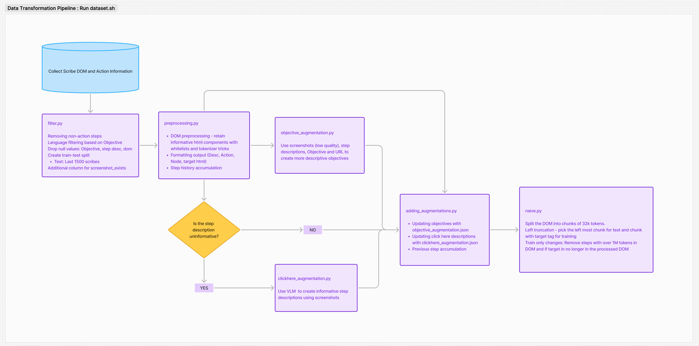

# ScribeAgent: Towards Specialized Web Agents Using Production-Scale Workflow Data
This repository contains the code for the paper [ScribeAgent: Towards Specialized Web Agents Using Production-Scale Workflow Data](https://arxiv.org/abs/2411.15004). We use proprietary dataset of public [Scribes](https://scribehow.com/gallery) to fine-tune LLMs into web agents. Check out our [blog post](http://scribehow.com/library/scribe-agent) and stay tuned for future releases!

Table of content:
- Code
  - Data preprocessing
  - Fine-tuning open-source LLMs
  - Mind2Web and WebArena benchmark evaluation
- Data
  - Example workflows collected from [Scribe](https://scribehow.com/) and the processed data


## Data  Preprocessing

For ScribeAgent, we consider an observation space consisting of the user obejective, current web page's URL and HTML-DOM, and previous actions. The `preprocessing` folder details the data preprocessing pipeline, including DOM pruning and input-output formatiing. For more information on how data moves through the pipeline, check out the [Data Transformation Flowchart](https://www.figma.com/board/dP4iwGchrQFnjNVHsj1I77/Untitled?node-id=0-1&node-type=canvas&t=B1gxNngVCBb8Roqt-0) and Section 3.2.2 of our [paper](https://arxiv.org/abs/2411.15004).



### File Structure for `preprocessing`

* `dataset.sh`: Bash script to sequencially run all preprocessing files needed to recreate the final train and test files.
* `example_workflow.csv`: This demostrates how a [scribe](https://scribehow.com/shared/Create_an_Invoice_on_QuickBooks_Online__UX4XK5mPQFKVmNXjB3TtoA) is given as input to the preprocessing script.
* `preprocessing.py`: Performs DOM preprocessing and target formatting
* `naive.py`: Most HTML DOMs are bigger than our model context window. We perform naive truncation at tag level, do left truncate the DOMs to fit within the model's context window.
* `filter.py`: Filters our null values and non-english scribes. Splits the dataset into train and test set
* `circle_all.py`: This is used to create screenshots with circled targets with OpenCV. This requires `xy_mapping.csv` from Snowflake

* `clickhere_augmentation.py`: Create action_id to augmented step description mapping using circled screenshots

* `objective_augmentation.py`: Create workflow_id to augmented objective description mapping using screenshots

* `adding_augmentations.py`: Adding objective and step description augmentations and prompt generation (model input)
* `GPT_augmentation_file`: This contains files used for augmenting step and objective descriptions. We save these files to avoid re-runnning GPT calls.
    * `train/test_objectives_clean.json`: Mapping from workflow_id to augmented objectives
    * `train/test_step_desc.json`: Mapping from action_id to augmented step description for click here actions
* `data`: Place to store all data
    * `screenshot`: Store screenshots (`action_id.jpeg`)
    * `circled_ss`: Store screenshots with circled targets (`action_id_circled.jpeg`)
    * `xy_position.csv`: Store circle coordinates


### How to run
Set the environment variable `HF_TOKEN` and `OPENAI_APIKEY`. Install the require libraries.
```
pip install -r requirements.txt
export HF_TOKEN=<your hf token>
export OPENAI_APIKEY=<your openai key>
```
Then:
```
chmod +x dataset.sh
./dataset.sh
```

## Fine-Tuning 
We use LoRA to fine-tune open-source LLMs for ScribeAgent. The `fine-tuning` folder contains the code for fine-tuning and inference, implemented using Huggingface and peft.
### File Structure for `fine-tuning`
* `collator.py`: Implements a custom collator for instruction fine-tuning.
* `finetuning.py`: Contains LoRA fine-tuning code utilizing the Hugging Face Trainer and PEFT library.
* `inference.py`: Performs inference using VLLM with FP8 quantization.
* `prepare_model.py`: Handles loading and merging of adapter weights to optimize inference speed.
* `requirements.txt`: Lists of Python dependencies required for fine-tuning and inference.
* `run.sh`: Specifies and passes all the necessary arguments to run finetuning and inference.

### How to run
Set the environment variable `HF_TOKEN`. Install the require libraries.
```
pip install -r requirements.txt
export HF_TOKEN=<your hf token>
```
Then:
```
chmod +x run.sh
./run.sh
```

## Benchmark Evaluation
We also include the code to adapt ScribeAgent, which takes HTML as input and outputs actions in HTML format, to public benchmarks.
- Mind2Web: Follow the [original GitHub repository](https://github.com/OSU-NLP-Group/Mind2Web/tree/main) to set up  the environment. Then, check out [this page](https://github.com/colonylabs/ScribeAgent/blob/main/benchmarks/mind2web/README.md) for detailed instructions to run the evaluation.
- WebArena: Check out [this page](https://github.com/colonylabs/ScribeAgent/blob/main/benchmarks/webarena/README.md) for detailed instructions to run the evaluation.

## Citation
If you find this repository useful, please consider citing our paper:
```
@misc{scribeagent,
      title={ScribeAgent: Towards Specialized Web Agents Using Production-Scale Workflow Data}, 
      author={Junhong Shen and Atishay Jain and Zedian Xiao and Ishan Amlekar and Mouad Hadji and Aaron Podolny and Ameet Talwalkar},
      year={2024},
      eprint={2411.15004},
      archivePrefix={arXiv},
      primaryClass={cs.CL},
}
```
